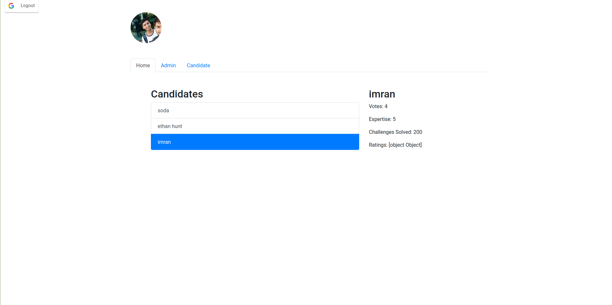

## Coda Poll App

Demo Admin Code: a001

## Installation

- clone the repo
- cd into project directory
- `npm i`
- `npm start`

## Feauters

- google login
- one time Vote
- admin add/edit/delete candidates
- lists candidates

## Details

- Frontend = React
- Backend APIs = Flask
- Database = Postgres
- Hosting Backend = Heroku
- Hosting Frontend = Netlify
- Code Hosting = GitHub
- Auth = Google Login
- Forms = Formik & Yup
- Styling = react-bootstrap

### Screenshots

1. Login Screen (Google Auth)

2. Home Screen (Candidates List)

3. Selected Candidate Details

4. After voting no vote option

5. Admin Screen

